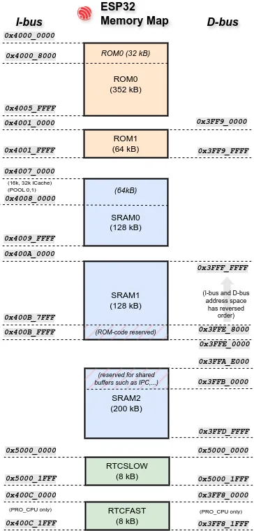

# Allocating Memory

In a `no_std` environment, the [`alloc`][alloc] crate is available as an option for heap allocation. This enables useful common Rust items such as `Vec` and `Box` and other collections that require heap allocation. In the some cases, `alloc` may be required for a dependency you wish to use.

We provide our own `no_std` heap allocator, [`esp-alloc`][esp-alloc]. But before enabling it, user should understand **why** they might want heap allocation and the trade-offs involved.

## Why Not Use a Heap?

While heap allocation offers flexibility, it comes with some costs:

- **Fragmentation**: Over time, dynamic allocation can cause *fragmentation*: small, scattered allocations may prevent large ones even if total memory is available. This can lead to subtle runtime failures.
- **Runtime Overhead**: Allocating and freeing memory incurs a computational cost, along with any overhead of the chosen allocator.

## Configurable Memory Placement and Reclaimed RAM

Some Espressif chips have non-contiguous memory mapping, not all physical RAM is usable as a single, flat heap. For example, some regions are reserved for ROM code usage, and cannot be overwritten Take the memory layout on the ESP32 for example. 

<p align="center">

</p>

There is also some memory that the 2nd stage bootloader uses during the boot process that can't be used as stack, but could be used as heap instead once in the main application. You can use the `#[ram(reclaimed)]` macro in the heap allocator declaration to use this otherwise unused memory.

```rust
// Use 64kB in dram2_seg for the heap, which is otherwise unused.
heap_allocator!(#[ram(reclaimed)] size: 64000);
```

## PSRAM

Our chips have a few hundred kilobytes of internal RAM, which could be insufficient for some applications. Some Espressif chips have the ability to use virtual addresses for external PSRAM (Pseudostatic RAM) memory. The external memory is usable in the same way as internal data RAM, with certain restrictions.

> ⚠️ **Note**: On Xtensa chips, atomics in PSRAM do not work correctly — they can cause data races and defeat their purpose. This means that
the allocator must not be used to allocate `Atomic*` types - either directly
or indirectly. ESP32 restrictions can be found [here]. This does **not** affect our RISC-V chips, where PSRAM works correctly with atomics.

### Allocator Considerations

You can only have **one global allocator** but the allocator can use multiple regions (e.g. PSRAM, internal RAM or even multiple blocks of them). You can use multiple allocators with the nightly feature `allocator api` and with [`allocator api2`][allocator api2], which [`esp-alloc`][esp-alloc] implements.

[esp-alloc]: https://crates.io/crates/esp-alloc
[alloc]: https://doc.rust-lang.org/alloc/
[here]: https://docs.espressif.com/projects/esp-idf/en/v5.4.1/esp32/api-guides/external-ram.html#restrictions
[allocator api2]: https://crates.io/crates/allocator-api2
