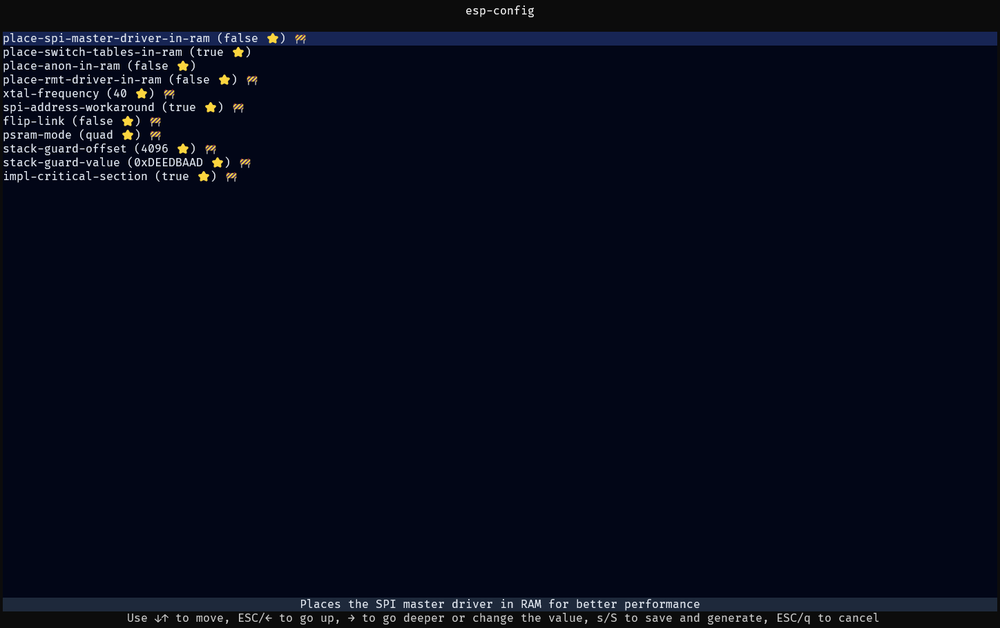

# Using `esp-config` (Optional)

If installed you can launch the tool from your project's directory by running `esp-config` which looks like this

You can also specify the targeted chip and the config file to use if the tool cannot figure it out.

With a project generated via `esp-generate` this shouldn't be needed.

See the [Configuration chapter](../application-development/configuration.md) for details how config files are organized and how to manually edit them.
