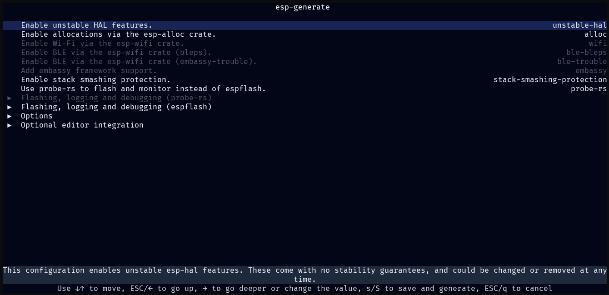

# Using `esp-generate`

With all the necessary tools installed, you're ready to create your first Rust project running on an Espressif chip.

## Generating a Project

To start, launch the interactive configuration tool by running:

```shell
esp-generate
```

`esp-generate` will prompt you for your chip, and a project name, before launching into a TUI with options to configure the project generation process.



Adjust the options as needed for your project. See [Available Options][available-options] section of the README. There is a small description of each option at the bottom of the TUI.

[available-options]: https://github.com/esp-rs/esp-generate?tab=readme-ov-file#available-options


## Flashing Options

There are two options for flashing the code to the target device:

- `espflash`: Default flashing tool.
- `probe-rs`: Enables RTT-based options and allows on chip debugging.
  - Make sure to enable `Use probe-rs to flash and monitor instead of espflash.` (`probe-rs` option) when generating your project.

> 💡 **Hint**: When using `espflash` you might want to enable `Use esp-backtrace as the panic handler.` and `Use the log crate to print messages.` under `Flashing, logging and debugging (espflash)`

> 💡 **Hint**: When using `probe-rs`, instead of `espflash`, you might want to enable `Use defmt to print messages.` and `Use panic-rtt-target as the panic handler.` under `Flashing, logging and debugging (probe-rs)`

## Generating the Project

When you are ready, you can generate the project by pressing `s` at the root of the TUI. When you save the project the tool will check for the required and optional tools being installed and shows the results, this may include asking you to install any tooling you may have missed, or now require based on the generation options.

## Running the Code

Getting your code up and running is as simple as executing:

```shell
cargo run --release
```

This command compiles your application, flashes it to the target device, and starts monitoring the log output.

🎉 Congratulations — you've successfully flashed your first Rust program onto an ESP32!

You're now ready to dive deeper into developing with Rust on the ESP32 platform.
