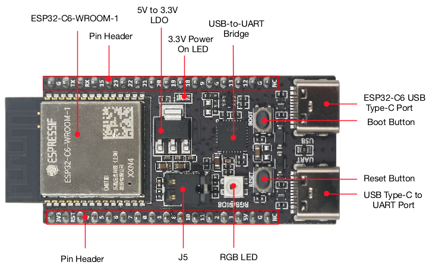

# Hardware Overview

The crates under the `esp-rs` organization include support for the [ESP32, ESP32-S, ESP32-C and ESP32-H Series SoCs][espressif-socs].

Each SoC has its own unique features while sharing some common traits. To select the appropriate chip for your project, please use the [Espressif Product Selector][product-selector].

The Espressif portfolio is based on two different system architectures:
- [Xtensa][xtensa-architecture]: The ESP32 and ESP32-S series are based on the Xtensa architecture.
- [RISC-V][riscv-architecture]: The ESP32-C and ESP32-H series are based on the RISC-V architecture.

We won't go into the details or differences between the two architectures here. Rust's official support differs between the two architectures. Xtensa is not yet officially supported by Rust; the reason for Rust not supporting Xtensa is that Rust uses LLVM as part of its compiler infrastructure, and LLVM does not yet support Xtensa. For this reason, we maintain custom forks of both LLVM and the Rust compiler that include Xtensa support, and we are actively working to upstream our changes to enable official support in the future.

> ⚠️ **Note**: We are actively working to upstream our forks. Below is the current status:
> 1. LLVM fork: We've made significant progress recently. For details, refer to the [tracking issue][llvm-github-fork-upstream issue].
> 2. Rust compiler fork: We've submitted all feasible Xtensa patches. Further progress depends on these changes being upstreamed into LLVM.

Feel free to refer to the [Technical Documentation][espressif-docs] for more information about the different SoCs.

> ⚠️ **Note**:  The ESP8266 is not supported.
>
> However, the ESP8684 (ESP32-C2) and ESP8685 (ESP32-C3) are supported. Notably, the ESP8685 (ESP32-C3) is pin-compatible with the ESP8266, making it a suitable drop-in replacement.

[espressif-socs]: https://www.espressif.com/en/products/socs
[product-selector]: https://products.espressif.com/#/
[xtensa-architecture]: https://www.cadence.com/content/dam/cadence-www/global/en_US/documents/tools/silicon-solutions/compute-ip/isa-summary.pdf
[riscv-architecture]: https://en.wikipedia.org/wiki/RISC-V
[espressif-docs]: https://www.espressif.com/en/support/documents/technical-documents
[llvm-github-fork-upstream issue]: https://github.com/espressif/llvm-project/issues/4

## Understanding an Espressif DevKit

Lets take the [ESP32-C6-DevKitC-1][c6-devkitc] as an example. Its a development board based in ESP32-C6 which comes with:

- ESP32-C6-WROOM-1 module:
  - Wi-Fi, BLE, and IEEE 802.15.4 support.
  - 8 MB SPI flash.
- GPIOs pins available for use.
- 2 buttons: Boot and Reset
  - Boot button: Download button. Holding down Boot and then pressing Reset initiates Firmware Download mode for downloading firmware through the serial port.
    - For more information, see [Boot Mode Selection][boot-mode-selection].
  - Reset button: Resets the device.
- 2 USB-C ports:
  - USB-C to UART port: Used for power supply to the board, for flashing applications to the chip, as well as the communication with the ESP32-C6 chip via the on-board USB-to-UART bridge.
  - USB-C port: Used for power supply to the board, for flashing applications to the chip, for communication with the chip using USB protocols, as well as for JTAG debugging.
- RGB LED: Addressable RGB LED, driven by GPIO8.
  - Note that this is not a standard RGB LED, it is a [WS2812B LED][esp-hal-smartled].

[c6-devkitc]: https://docs.espressif.com/projects/esp-dev-kits/en/latest/esp32c6/esp32-c6-devkitc-1/index.html
[boot-mode-selection]: https://docs.espressif.com/projects/esptool/en/latest/esp32c6/advanced-topics/boot-mode-selection.html?highlight=boot%20mode
[esp-hal-smartled]: https://github.com/esp-rs/esp-hal-community/tree/main/esp-hal-smartled

