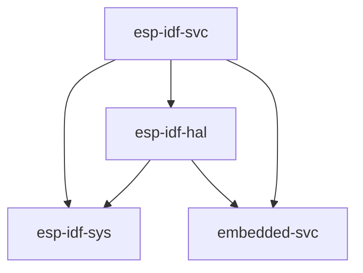

# Using the Rust Standard Library (`std`)

Espressif provides a C-based development framework called [esp-idf] which has support for all Espressif chips starting with the ESP32; note that this framework does _not_ support the ESP8266.

`esp-idf` in turn provides a [newlib] environment with enough functionality to build the Rust standard library (`std`) on top of it. This is the approach that is being taken to enable `std` support on ESP devices.

## Chip Support

For applications targeting `std` to be built for ESP devices, two things are required:

1. LLVM/Clang support
2. Support for the device in `esp-idf`

Refer to the table below to see if your chip is supported.

|   Chip   | Supported? |
| :------: | :--------: |
|  ESP32   |     ✅      |
| ESP32-C2 | _planned_  |
| ESP32-C3 |     ✅      |
| ESP32-S2 |     ✅      |
| ESP32-S3 |     ✅      |
| ESP32-H2 | _planned_  |
| ESP8266  |     ❌      |

Since `esp-idf` does not have support for the ESP8266, we unfortunately are unable to use these libraries with it. See the [Bare Metal] page for information on the `no_std` HAL for this chip.

[bare metal]: ./bare-metal.md

## Standard Library Features

The supported `std` features are as follows:

- Threads
- Mutexes and other synchronization primitives
- Collections
- Random number generation
- Sockets

In addition to the `std` features, there is an [embedded-svc] implementation for `esp-idf`, [esp-idf-svc], which adds extra support for services/modules not available in the standard library, including:

- Wi-Fi management
- NVS (non-volatile storage)
- Networking services like `httpd` and `ping`

In general, this approach should feel quite similar to developing for most normal PC environments.

[esp-idf]: https://github.com/espressif/esp-idf
[newlib]: https://sourceware.org/newlib/
[embedded-svc]: https://github.com/esp-rs/embedded-svc
[embedded-hal]: https://github.com/rust-embedded/embedded-hal
[esp-idf-svc]: https://github.com/esp-rs/esp-idf-svc

## Relevant `esp-rs` crates

| Repository            | Description                                                                                                   |
| --------------------- | ------------------------------------------------------------------------------------------------------------- |
| [esp-rs/esp-idf-hal]  | An implementation of [embedded-hal] and other traits using the `esp-idf` framework.                       |
| [esp-rs/esp-idf-svc]  | An implementation of [embedded-svc] using `esp-idf`'s drivers.                                                  |
| [esp-rs/esp-idf-sys]  | Rust bindings to the [esp-idf] development framework. Gives raw (`unsafe`) access to drivers, Wi-Fi and more. |
| [esp-rs/embedded-svc] | Abstraction traits for embedded services. (`WiFi`, `Network`, `Httpd`, `Logging`, etc.)                       |

The aforementioned crates have interdependencies, and this relationship can be seen below.



[esp-rs/embedded-svc]: https://github.com/esp-rs/embedded-svc
[esp-rs/esp-idf-svc]: https://github.com/esp-rs/esp-idf-svc
[esp-rs/esp-idf-sys]: https://github.com/esp-rs/esp-idf-sys
[esp-rs/esp-idf-hal]: https://github.com/esp-rs/esp-idf-hal

## FAQ

### I updated my `sdkconfig.defaults` file but it doesn't appear to have had any effect

You must clean your project and rebuild for changes in the `sdkconfig.defaults` to take effect:

```shell,ignore
cargo clean
cargo build
```

### The documentation for the crates mentioned on this page is out of date or missing

Due to the [resource limits] imposed by [docs.rs], internet access is blocked while building documentation and as such we are unable to build the documentation for `esp-idf-sys` or any crate depending on it.

Instead, we are building the documentation and hosting it ourselves on GitHub Pages:

- [`esp-idf-hal` Documentation]
- [`esp-idf-svc` Documentation]
- [`esp-idf-sys` Documentation]

[resource limits]: https://docs.rs/about/builds#hitting-resource-limits
[docs.rs]: https://docs.rs
[`esp-idf-hal` documentation]: https://esp-rs.github.io/esp-idf-hal/esp_idf_hal/
[`esp-idf-svc` documentation]: https://esp-rs.github.io/esp-idf-svc/esp_idf_svc/
[`esp-idf-sys` documentation]: https://esp-rs.github.io/esp-idf-sys/esp_idf_sys/

### \*\*\*ERROR\*\*\* A stack overflow in task main has been detected

If the second-stage bootloader reports this error, you likely need to increase the stack size for the main task. This can be accomplished by adding the following to the `sdkconfig.defaults` file:

```ignore
CONFIG_ESP_MAIN_TASK_STACK_SIZE=7000
```

In this example, we are allocating 7kB for the main task's stack.

### How can I completely disable the watchdog timer(s)?

Add to your `sdkconfig.defaults` file:

```ignore
CONFIG_INT_WDT=n
CONFIG_ESP_TASK_WDT=n
```

Recall that you must clean your project before rebuilding when modifying these configuration files.
