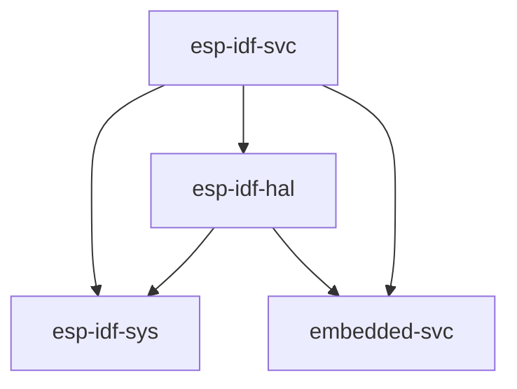

# Using the Standard Library (`std`)

Espressif provides a C-based development framework called [ESP-IDF][esp-idf-github]. It has, or will have, support for all Espressif chips starting with the ESP32, note that this framework  _doesn't_ support the ESP8266.

ESP-IDF, in turn, provides a [newlib][newlib-env] environment with enough functionality to build the Rust standard library (`std`) on top of it. This is the approach that is being taken to enable `std` support on Epressif devices.

[esp-idf-github]: https://github.com/espressif/esp-idf
[newlib-env]: https://sourceware.org/newlib/

## Current Support

The Espressif products supported for Rust `std` development are the ones supported by the ESP-IDF framework. For details on different versions of ESP-IDF and support of Espressif chips, see [this table][esp-idf-release-compatibility].

[esp-idf-release-compatibility]: https://github.com/espressif/esp-idf#esp-idf-release-and-soc-compatibility/

When using `std`, you have access to a lot of features that exist in [ESP-IDF][esp-idf-github], including threads, mutexes and other synchronization primitives, collections, random number generation, sockets, etc.

### Relevant `esp-rs` Crates

| Repository                     | Description                                                                                                   |
| ------------------------------ | ------------------------------------------------------------------------------------------------------------- |
| [`embedded-svc`][embedded-svc] | Abstraction traits for embedded services (`WiFi`, `Network`, `Httpd`, `Logging`, etc.)                        |
| [`esp-idf-svc`][esp-idf-svc]   | An implementation of [embedded-svc] using `esp-idf` drivers.                                                  |
| [`esp-idf-hal`][esp-idf-hal]   | An implementation of the `embedded-hal` and other traits using the `esp-idf` framework.                       |
| [`esp-idf-sys`][esp-idf-sys]   | Rust bindings to the `esp-idf` development framework. Gives raw (`unsafe`) access to drivers, Wi-Fi and more. |

The aforementioned crates have interdependencies, and this relationship can be seen below.

[embedded-svc]: https://github.com/esp-rs/embedded-svc
[esp-idf-svc]: https://github.com/esp-rs/esp-idf-svc
[esp-idf-sys]: https://github.com/esp-rs/esp-idf-sys
[esp-idf-hal]: https://github.com/esp-rs/esp-idf-hal

### When You Might Want to Use the Standard Library (`std`)

- Rich functionality: If your embedded system requires lots of functionality like support for networking protocols, file I/O, or complex data structures, you will likely want to use hosted-environment approach because `std` libraries provide a wide range of functionality that can be used to build complex applications.
- Portability: The `std` crate provides a standardized set of APIs that can be used across different platforms and architectures, making it easier to write code that is portable and reusable.
- Rapid development: The `std` crate provides a rich set of functionality that can be used to build applications quickly and efficiently, without worrying, too much, about low-level details.

