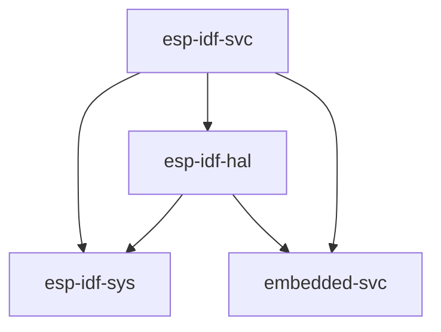

# Using the Standard Library (`std`)

Espressif provides a C-based development framework called [esp-idf][esp-idf-github] which has support for all Espressif chips starting with the ESP32; note that this framework does _not_ support the ESP8266. See also Section [Support for Espressif Products][rust-esp-book-std-vs-no-std-support].

[rust-esp-book-std-vs-no-std-support]: ./comparing-std-and-no_std.html#support-for-espressif-products

`esp-idf` in turn provides a [newlib][newlib-env] environment with enough functionality to build the Rust standard library (`std`) on top of it. This is the approach that is being taken to enable `std` support on ESP devices.

[esp-idf-github]: https://github.com/espressif/esp-idf
[newlib-env]: https://sourceware.org/newlib/

## Supported `std` Features

When using `std`, you have access to a lot of features that exist in [esp-idf][esp-idf-github], including threads, mutexes and other synchronization primitives, collections, random number generation, sockets...

[esp-rs/esp-idf-svc](https://github.com/esp-rs/esp-idf-svc) adds extra support for services/modules not available in the standard library, such as Wi-Fi management, NVS (non-volatile storage), networking services, such as `httpd` and `ping`, etc.

### Relevant `esp-rs` crates

[esp-idf-github]: https://github.com/espressif/esp-idf

| Repository            | Description                                                                                                   |
| --------------------- | ------------------------------------------------------------------------------------------------------------- |
| [esp-rs/esp-idf-svc]  | An implementation of [embedded-svc] using `esp-idf` drivers.                                                  |
| [esp-rs/esp-idf-hal]  | An implementation of the `embedded-hal` and other traits using the `esp-idf` framework.                       |
| [esp-rs/esp-idf-sys]  | Rust bindings to the `esp-idf` development framework. Gives raw (`unsafe`) access to drivers, Wi-Fi and more. |
| [esp-rs/embedded-svc] | Abstraction traits for embedded services (`WiFi`, `Network`, `Httpd`, `Logging`, etc.)                       |

[newlib]: https://sourceware.org/newlib/
[embedded-svc]: https://github.com/esp-rs/embedded-svc
[esp-idf-svc]: https://github.com/esp-rs/esp-idf-svc

The aforementioned crates have interdependencies, and this relationship can be seen below.

[esp-rs/embedded-svc]: https://github.com/esp-rs/embedded-svc
[esp-rs/esp-idf-svc]: https://github.com/esp-rs/esp-idf-svc
[esp-rs/esp-idf-sys]: https://github.com/esp-rs/esp-idf-sys
[esp-rs/esp-idf-hal]: https://github.com/esp-rs/esp-idf-hal

