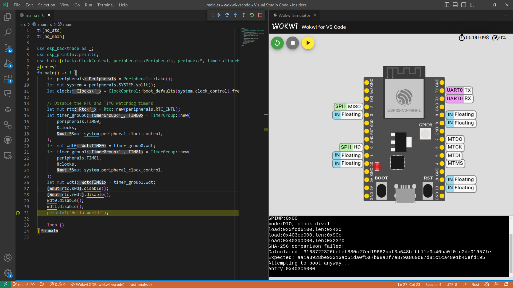

# Wokwi

[Wokwi][wokwi] is an online simulator that supports simulating Rust projects (both `std` and `no_std`) in Espressif Chips.
See [wokwi.com/rust][wokwi-rust] for a list of examples and a way to start new projects.

Wokwi offers Wi-Fi simulation, Virtual Logic Analyzer, and [GDB debugging][gdb-debugging] among many other features, see
[Wokwi documentation][wokwi-documentation] for more details. For ESP chips, there is a table of [simulation features][wokwi-simulation-features] that are currently supported.

[wokwi]: https://wokwi.com/
[wokwi-rust]: https://wokwi.com/rust
[gdb-debugging]: https://docs.wokwi.com/gdb-debugging
[wokwi-documentation]: https://docs.wokwi.com/
[wokwi-simulation-features]: https://docs.wokwi.com/guides/esp32#simulation-features

## Using Wokwi for VS Code extension
Wokwi offers a VS Code extension that allows you to simulate a project directly in the code editor by only adding a few files.
For more information, see [Wokwi documentation][wokwi-vscode].
You can also debug your code using the VS Code debugger, see [Debugging your code][wokwi-debugging].

When using any of the [templates][templates] and not using the default values, there is a prompt (`Configure project to support Wokwi simulation with Wokwi VS Code extension?`) that generates the required files to use Wokwi VS Code extension.

[wokwi-vscode]: https://docs.wokwi.com/vscode/getting-started
[wokwi-debugging]: https://docs.wokwi.com/vscode/debugging
[templates]: ./../../writing-your-own-application/generate-project/index.md

## Using `wokwi-server`

[`wokwi-server`][wokwi-server] is a CLI tool for launching a Wokwi simulation of your project. I.e., it allows you
to build a project on your machine, or in a container, and simulate the resulting binary.

[`wokwi-server`][wokwi-server] also allows simulating your resulting binary on other Wokwi projects, with more hardware parts other than the chip itself. See the corresponding [section of the `wokwi-server`][wokwi-server-custom] README for detailed instructions.

[wokwi-server]: https://github.com/MabezDev/wokwi-server
[wokwi-server-custom]: https://github.com/MabezDev/wokwi-server#simulating-your-binary-on-a-custom-wokwi-project

## Custom Chips
Wokwi allows generating custom chips that let you program the behavior of a component not supported in Wokwi. For more details, see the official [Wokwi documentation][wokwi-custom-chip].

Custom chips can also be written in Rust! See [Wokwi Custom Chip API][rust-chip-api] for more information. For example, custom [inverter chip][custom-chip-example] in Rust.

[wokwi-custom-chip]: https://docs.wokwi.com/chips-api/getting-started
[rust-chip-api]: https://github.com/wokwi/wokwi_chip_ll
[custom-chip-example]: https://github.com/wokwi/rust_chip_inverter
